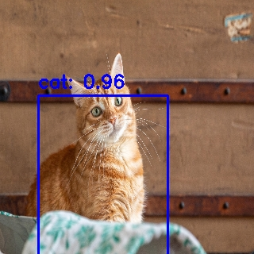
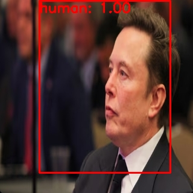

# Single Shot Detection

The project adapts SSD algorithm from paper "SSD: Single Shot MultiBox Detector"(https://arxiv.org/abs/1512.02325).

[View the Report Here](https://kyon317.github.io/SingleShotDetection/pdf-viewer.html)

---

# Results showcase

  
  
  

Image results

## Graph

  

